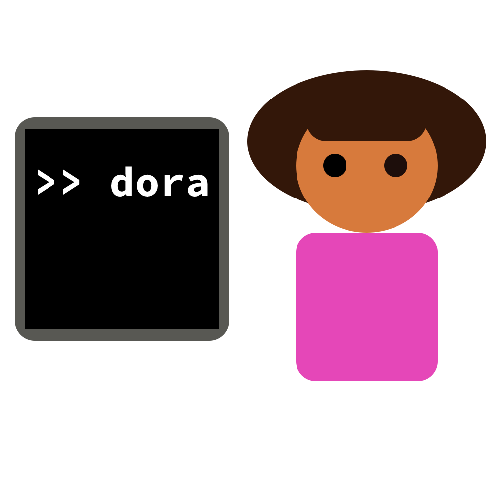
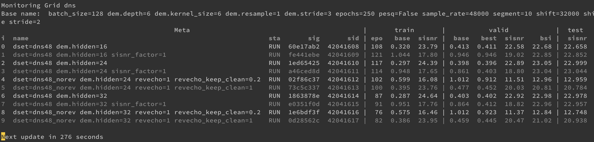

# Dora The Explorer, a friendly experiment manager


<p align="center">
</p>

<p align="center">
</p>

## Table of Content

- [Installation](#Installation)
- [Introduction](#Introduction)
- [Making your code compatible with Dora](#making-your-code-compatible-with-dora)
- [The `dora` command](#the-dora-command)
- [`dora run`: Running XP locally](#dora-run-running-xp-locally)
- [`dora launch`: Launching XP remotely](#dora-launch-launching-xp-remotely)
- [`dora info`: Inspecting an XP](#dora-info-inspecting-an-xp)
- [`dora grid`: Managing a grid search](#dora-grid-managing-a-grid-search)
- [The Dora API](#the-dora-api)
- [Sharing XPs](#sharing-xps)
- [Advanced configuration](#advanced-configuration)
- [Contributing](#contributing)

## Installation

```bash
# For bleeding edge
pip install -U git+https://github.com/facebookincubator/submitit@main#egg=submitit
pip install -U git+https://git@github.com/facebookresearch/dora#egg=dora-search

# For stable release
pip install -U dora-search
```

## What's up?

See [the changelog](CHANGELOG.md) for details on releases.

- 2022-06-09: version 0.1.10: adding HiPlot support ! Updated PL support, many small fixes.
- 2022-02-28: version 0.1.9
- 2021-12-10: version 0.1.8: see changelog, many of small changes.
- 2021-11-08: version 0.1.7: support for job arrays added.
- 2021-10-20: version 0.1.6 released, bug fixes.
- 2021-09-29: version 0.1.5 released.
- 2021-09-07: added support for a `git_save` option. This will ensure that the project git is clean
    and make a clone from which the experiment will run. This does not apply to `dora run` for easier
    debugging (but you can force it with `--git_save`).
- 2021-06-21: added support for Hydra 1.1. Be very careful if you update to Hydra 1.1, there are some non backward compatible changes in the way group config are parsed, see [the Hydra release notes](https://hydra.cc/docs/upgrades/1.0_to_1.1/default_composition_order) for more information.

(FB Only) If you are using Dora and want to receive updates on bug fixes and new versions, ping me (@defossez) on Workchat.


## Introduction

Dora is an experiment launching tool which provides the following features:

- **Grid search management:** automatic scheduling and canceling of the jobs
    to match what is specified in the grid search files. Grid search files
    are pure Python, and can contain arbitrary loops, conditions etc.
- **Deduplication:** experiments are assigned a signature based on their arguments.
    If you ask twice for the same experiment to be ran, it won't be scheduled twice,
    but merged to the same run. If your code handles checkpointing properly,
    any previous run will be automatically resumed.
- **Monitoring:** Dora supports basic monitoring from inside the terminal.
    You can customize the metrics to display in the monitoring table,
    and easily track progress, and compare runs in a grid search.

Some Dora concepts:

- A *Grid* is a python file with an `explorer` function, wrapped in a `dora.Explorer`.
    The explorer function takes a `dora.Launcher` as argument. Call repeatidly
    the `dora.Launcher` with a set of
    hyper-parameters to schedule different experiments.
- An *XP* is a specific experiment. Each experiment is defined by the arguments
    passed to the underlying experimental code, and is assigned a signature
    based on those arguments, for easy deduplication.
- A *signature* is the unique XP identifier, derived from its arguments.
    You can use the signature to uniquely identity the XP across runs, and easily
    access logs, checkpoints etc.
- A *Sheep* is the association of a Slurm/Submitit job, and an XP. Given an XP,
    it is always possible to retrieve the last Slurm job that was associated with it.


## Making your code compatible with Dora

In order to derive the XP signature, Dora must know about the configuration schema your project is following, as well as
the parsed arguments for a run.
Dora supports two backends for that : `argparse`, and `hydra`. On top of that, Dora provides a smooth integration
with Pytorch Lightning for projects that uses it.

In all cases, you must have a specific python package (which we will call here `myproj`),
with a `train` module in it, (i.e. `myproj.train` module, stored in the `myproj/train.py` file.)

The `train.py` file must contain a `main` function that is properly decorated, as explained hereafter.

### Argparse support

Here is a template for the `train.py` file:

```python
import argparse
from dora import argparse_main, get_xp

parser = argparse.ArgumentParser("mycode.train")
...


@argparse_main(
    dir="./where_to_store_logs_and_checkpoints",
    parser=parser,
    exclude=["list_of_args_to_ignore_in_signature, e.g.", "num_workers",
             "can_be_pattern_*", "log_*"],
    use_underscore=True,  # flags are --batch_size vs. --batch-size
    git_save=False,  # if True, scheduled experiments will run from a separate clone of the repo.
)
def main():
    # No need to reparse args, you can directly access them from the current XP
    # object.
    xp = get_xp()
    xp.cfg # parsed arguments
    xp.sig  # signature for the current run
    xp.folder  # folder for the current run, please put your checkpoint relative
               # to this folder, so that it is automatically resumed!
    xp.link  # link object, can send back metrics to Dora

    # If you load a previous checkpoint, you should always make sure
    # That the Dora Link is consistent with what is in the checkpoint with
    # history = checkpoint['history']
    # xp.link.update_history(history)

    for t in range(10):
        xp.link.push_metrics({"loss": 1/(t + 1)})
    ...
```


### Hydra support

The template for `train.py`:
```python
from dora import hydra_main, get_xp


@hydra_main(
    config_path="./conf",  # path where the config is stored, relative to the parent of `mycode`.
    config_name="config"  # a file `config.yaml` should exist there.
)
def main(cfg):
    xp = get_xp()
    xp.cfg # parsed configuration
    xp.sig  # signature for the current run
    # Hydra run folder will automatically be set to xp.folder!

    xp.link  # link object, can send back metrics to Dora
    # If you load a previous checkpoint, you should always make sure
    # That the Dora Link is consistent with what is in the checkpoint with
    # history = checkpoint['history']
    # xp.link.update_history(history)

    for t in range(10):
        xp.link.push_metrics({"loss": 1/(t + 1)})
    ...
```

You can customize `dora` behavior from the `config.yaml` file, e.g.

```yaml
my_config: plop
num_workers: 40
logs:
    interval: 10
    level: info

dora:
    exclude: ["num_workers", "logs.*"]
    dir: "./outputs"
    git_save: true  # set git_save option for the project.
```

### PyTorch Lightning support

Dora supports PyTorch Lightning (PL) out of the box. Dora will automatically
capture logged metrics (make sure to use `per_epoch=True`), and handles distribution
(you should not pass `gpus=...` or `num_nodes=...` to PL).

```python
import dora.lightning


@dora.argparse_main(...)
def main():
    xp = dora.get_xp()
    args = xp.cfg
    # Replace Pytorch lightning `Trainer(...)` with the following:
    trainer = dora.lightning.get_trainer(...)
    # Or when using argparse parsing:
    trainer = dora.lightning.trainer_from_argparse_args(args)
```

See [examples/pl/train.py](examples/pl/train.py) for a full example including
automatic reloading of the last checkpoint, logging etc.


**Important:** Dora deactivates the default PL behavior of dumping a mid-epoch
checkpoint upon preemption, as this lead to non deterministic behavior
(as PL would skip this epoch upon restart). Dora assumes you save checkpoints
from time to time (e.g. every epoch). To get back the old behavior,
pass `no_unfinished_epochs=False` to `get_trainer`. See [examples/pl/train.py](examples/pl/train.py)
for an example of how to implement checkpointing in a reliable manner.


### Distributed training support (non PyTorch Lightning)

Dora supports distributed training, and makes a few assumptions for you.  You should initialize distributed training through Dora, by calling in your `main` function:

```python
import dora.distrib
dora.distrib.init()
```

**Note:** This is not required for Pytorch Lightning users, see the PL section hereafter, everything will be setup automatically for you :)


### Git Save

You can set the `git_save` option on your project, see hereafter on how to do it for either argparse or Hydra
based projects.
When this option is set, Dora makes individual clones of your project repository for each experiment that is scheduled.
The job will then run from that clean clone. This allows both to keep track of the exact
code that was used for an experiment, as well as preventing code changes to impact pending, or requeued
jobs.
If you reschedule a failed or cancelled job, the clone will however be updated with the current code.

In order to use this option, your code should be able to run from a fresh clone of the repository.
If you need to access to resources that are specified with a path relative to the original
repo, use `dora.to_absolute_path()`. Note that this is similar to `hydra.utils.to_absolute_path()`. In fact, you can safely replace the Hydra version with this one,
as even when `git_save` is not set, the Dora one automatically falls back to the Hydra one (if Hydra is used).

**The repository must be completely clean** before scheduling remote jobs, and all files should be either
tracked or git ignored. This is very restricive, but this makes implementing this feature
much simpler and safe. Also this forces good practice :)
Only the `dora run` command can be used on a dirty repository, to allow
for easy debugging. For the `dora launch` and `dora grid` command, you can also use the `--no_git_save`
option to temporarily deactivate this feature.

The clone for each experiment is located inside the `code/` subfolder inside the XP folder (which you can get with the `dora info` command for instance).


## The `dora` command

Dora will install a `dora` command that is the main way to interact with it.
The `dora` command defines 4 sub-commands, detailed in the following sections:
- `dora run`: run training code locally (e.g. for debugging).
- `dora launch`: launch remote jobs, useful for one-off experiments.
- `dora info`: get information on a specific job/XP, logs etc.
- `dora grid`: launch an entire grid search defined in a grid file. Only missing XP will be scheduled.
    Will also reports status and latest metrics.

In order for Dora to find your code, you must pass your training package
(i.e. `mycode`) as `dora -P mycode [run|launch|grid|info]`.
This flag can be skipped if `mycode` is in the current working directory and is the only folder with a `train.py` file in it, in which
case Dora will find it automatically.
You can also export `DORA_PACKAGE=mycode` to avoid having to give the `-P` flag explicitely.

You can use a different script name than `train.py` with `-M, --main_module`,
or setting the `DORA_MAIN_MODULE` env variable.

**Attention:** those flags should be specified BEFORE the `run | launch |info |grid` part: `dora -P mycode run`, not `dora run -P mycode`.

### Examples

See the [examples](examples/) folder for a few examples using argparse, Hydra
and Pytorch Lightning, in order to test the commands described here.
To play with them, first install Dora (`pip install .` from the top-level of the repo), then `cd examples`, and use `dora -P example_name ...`
to let Dora know which example to use!


## `dora run`: Running XP locally

You can run an XP locally with

```bash
dora run [TRAINING_ARGS ...]
```

**Warning**: for the `argparse` backend, you must insert `--` between the dora args and your own training args, i.e.:

```bash
dora run -- [TRAINING_ARGS ...]
```

`dora run` supports two flags:
- `-d`: distributed training using all available gpus. The master worker output will be to the shell, and other workers will be redirected to a log file in the XP folder.
- `-f sig`: this will inject the hyper-parameters from the XP with the given sig on top of the one provided on the command line. Useful to resume locally a remote job that failed.
- `--git_save`: clone the repo inside the XP folder and execute from there. This is mostly for debugging,
    and in general is not needed.

## `dora launch`: Launching XP remotely

Dora supports scheduling experiments on Slurm. If you need to schedule many of them, then a grid file is properly better.

```dora
dora launch [--dev] [-g NUMBER_OF_GPUS] [TRAINING_ARGS ...]
```

Dora will automatically select the appropriate number of nodes and tasks per nodes based on the number of GPUs required, as well as scale required memory.
For instance, if `-g 16`, Dora will schedule on 2 nodes with 8 gpus each.

This command will launch the command, and immediately tail its log and monitor its progress, just like if it were running in locally.
If you want to kill the command if you kill the local process, you can add the `-a`, `--attach` flag.
To avoid tailing the log, just pass `--no_tail`.


If a job already exist for the given XP, Dora will not schedule a second one, but reuse the existing job.

If a previous run has failed or was canceled, Dora will not automatically start a new one, to give you a chance to inspect the logs.
If you want to reschedule a run, use the `-r, --retry` flag.

Other flags:

- `-f SIG`: injects the arguments from the XP matching this signature, on top of the one provided on the command line.
- `-R, --replace`: replace any running job (i.e. cancels, and schedules a new one).
- `-D, --replace_done`: also reschedule a job even if a previous one completed successfully.
- `-p, --partition PARTITION`: partition to use.
- `-c, --comment COMMENT`: comment for the job (e.g. if priority is used).
- `--clear`: cancel any previous job, clear the XP folder (i.e. delete checkpoints) and reschedule.


## `dora info`: Inspecting an XP

You can get information on an XP with the `dora info` command:

```bash
dora info [TRAINING_ARGS ...]
dora info -f SIGNATURE
dora info -j SLURM_ID
```

You can either specify the XP by listing all of its training arguments, by passing its signature, or even the latest Slurm id associated with it.
The info command supports a number of flags:
- `-l`: print the entire log for the main task (this only work for remote jobs, not XP ran locally with `dora run`)
- `-t`: tail the log for the main task.


## `dora grid`: Managing a grid search

The main benefit from Dora is the ability to handle arbitarily complex grid searches.
Each *grid* is defined by a grid file, inside a `grids` package (i.e. `mycode.grids.my_grid`).
The grid file defines an `explorer` function, decorated by an `Explorer` class.
The `Explorer` class defines various metadata, in particular on which metrics
to display when calling the grid command.
The `explorer` function takes a `dora.Launcher` as an argument, and
should repeatidly call it to schedule experiments.

Here is an example of grid search file, for instance `mycode.grids.mygrid`.

```python
from itertools import product
from dora import Explorer, Launcher

@Explorer
def explorer(launcher: Launcher):
    launcher(batch_size=128)  # Schedule an experiments with the given batch size.
    # For an argparse based project, this will get converted to the `--batch_size=128` flag
    # You can pass `use_underscore=False` to `argparse_main` to get instead `--batch-size=128`.

    sub = launcher.bind(lr=0.01)  # bind some parameter value, in a new launcher
    sub.slurm_(gpus=8)  # all jobs scheduled with `sub` will use 8 gpus.

    sub()  # Job with lr=0.01 and 8 gpus.
    sub.bind_(epochs=40)  # in-place version of bind()
    sub.slurm(partition="dev")(batch_size=64)  # lr=0.01, 8 gpus, dev, bs=64 and epochs=40.

    launcher.slurm_(gpus=16)  # Now using 16 gpus per job, i.e. 2 full nodes.
    # Nice thing of native python, you can define arbitrary set of XP!
    for lr, bs in product([0.1, 0.01, 0.001], [16, 32, 64]):
        if bs > 32 and lr < 0.01:
            # this is just too extreme, let's skip
            continue
        launcher(lr=lr, batch_size=bs)

    # Job arrays are also supported.
    # The only limitation is that all jobs in an array must use exactly
    # the same slurm config.
    with launcher.job_array():
        for seed in range(1, 100):
            launcher(seed=seed)

```

You can then call

```bash
dora grid mygrid
```

This will do 3 thing:

- Any XP defined in the `explorer` function will be scheduled, if not already running
    or completed.
- Any XP that was previously defined in the grid file, but is no longer referenced
    will be cancelled.
    **If you just comment one line in the grid file, the corresponding job will automatically be killed.**
- A table containing job status and metadata as well as the latest metrics will
    be printed every 5 minutes.

### The Launcher API

Here is a more comprehensive description of what `Launcher` object can do.

- `launcher.bind_(...)`: remember the given parameters (command line option for argparse based
project, or overrides for Hydra based ones) for future scheduling, i.e. all experiments
later scheduled with that launcher will have those parameters set.
- `sub = launcher.bind(...)`: same as bind, but returns a new "sub" launcher, i.e. the object
`launcher` is not changed, only experiments scheduled with `sub` will use the given params.
`sub` also inherits from all the params already bound to its parent launcher (i.e. previous call to `launcher.bind_`).
Creating a sub-launcher is especially recommended inside loops, to avoid leaking params to the next loop iteration.
- `launcher(...)`: schedules an experiment with the given params, plus all the ones that have
been aggregated through the various calls to `bind_` and to `bind`. This is equivalent to
`launcher.bind(...)()`.
- `launcher.slurm_(key=value, ...)` and `launcher.slurm(key=value, ...)`: same as `bind_` and `bind`
but for the slurm config (nb of GPUs etc). For a list of possible options, checkout
[SlurmConf](https://facebookresearch.github.io/dora/dora/conf.html#dora.conf.SlurmConfig).


Now let us describe the format for passing parameters overrides or command line flags to
`launcher.bind_()`, `launcher.bind()` or `launcher()`:

- Simple parameters (i.e. not nested) can be passed as kwargs, for instance if you have a `--batch_size` flag, you can
do `launcher.bind(batch_size=64)`.
- Command line flags can be explicitely passed as a list of strings, for instance `launcher.bind(['--lr=1e-4'])`.
- A dictionary of overrides can be passed, for instance `launcher.bind({'batch_size': 64})`. Note that this
also allows for nested keys in Hydra: `launcher.bind({'model.channels': 256})`. With Hydra, you can
also define new keys with `{'+model.activation': 'relu'}`. You must not remove keys though.
- Finally you can combine all of those (for a Hydra project here):

```python
launcher.bind(['optim.lr=1e-4'], {'model.channels': 256, 'seed': 42}, {'+model.activation': 'relu'}, batch_size=64)
```


### Flags

The `dora grid` command supports the following flags:

- `-r, --retry`: failed or cancelled XP within one grid file will
    be rescheduled.
- `-R, --replace`: any running XP will be replaced by a new job.
- `-D, --replace_done`: any XP in the grid that previously completed will be rescheduled.
- `-C, --cancel`: cancel all XPs in a grid.
- `--clear`: cancel any previous jobs, clear all XP folders (i.e. delete checkpoints) and reschedule. This will ask confirmation first, because this is quite dangerous.

- `-i, --interval INTERVAL`: the table monitoring all jobs will be updated every `INTERVAL`
    minutes, until all jobs are finished or failed.
- `-T, --trim IDX`: trim all the metrics to the number of epochs of the XP
    with the given index inside the grid, i.e. pretend that all XPs have at most
    as many epochs as the XP with the given index.
- `-L, --trim_last`: trim all XPs to the least advanced XP i.e. if the least
    advanced XP has only 3 epochs, show the metrics at epoch 3 for all XPs.
- `-f, --folder IDX`: only print the folder of the XP with the given idnex.
- `-l, --log IDX`: print the full log of the XP with the given index.
- `-t, --tail IDX`: tail the log of the XP with the given index.
- `--no_monitoring`: only show the table once and return.
- `--dry_run`: only simulate actions.

### Patterns

You can also pass patterns to the `grid` command, for instance

```
dora grid mygrid bs=64
```
will only show XPs which have `bs=64` in their name. You can see the name by launching
the grid normally. Names are heavily shorten to avoid running out of space, in particular
nested structure will have all their components but the leaf be shorten. You
can negate a query with `!`, for instance `dora grid mygrid '!bs=64'` (use quotes
because `!` will be interpreted by the shell otherwise).
Multiple patterns are interpreted as logical AND between them.


Note that with the latest version (be sure to update), the `--clear`, or `-C, --cancel` flags
will only apply to the XP matching the pattern. Similarly, only XP matching those patterns
will be scheduled.

### Explorer class

The `Explorer` class allows to customize which metric to report, and with what precision. It also gives you a chance to reorganize metrics or further post process them (for instance, extracting max, min etc.).
See [Customize metrics displayed](#customize-metrics-displayed-in-explorer) hereafter for more explanation.

By convention, files starting with `_` inside the `grids` folder are ignored by Dora, and are a good place to put utility code such as your custom `Explorer` classes.
For an example with detailed comments, go checkout [the Explorer classes for BrainMagick](https://github.com/fairinternal/brainmagick/blob/main/bm/grids/_explorers.py#L7).

### HiPlot support

Dora supports HiPlot out of the box. Make sure it is installed (`pip install hiplot`), then
you can run
```bash
python -m hiplot dora.hiplot.load --port=XXXX
```
In the prompt, you can type any number of grid names or XP sig, separated by spaces.
You can customize the metrics displayed by inheriting [dora.hiplot.HiPlotExplorer](https://facebookresearch.github.io/dora/dora/hiplot.html#dora.hiplot.HiPlotExplorer)
in a class inside `yourproject.grids._hiplot`. Then, select your explorer with
the command `explorer=MyExplorer` inside the HiPlot prompt (along the grid names and XP
sigs, in any order).

## The Dora API

Dora provides some API, including the possibility to run grid searches
directly from an IPython notebook. See the
[Dora API](https://facebookresearch.github.io/dora/dora).

### DecoratedMain

The most useful class is the
[DecoratedMain](https://facebookresearch.github.io/dora/dora/main.html#dora.main.DecoratedMain), which is the decorated main function in your project. You can use it
to retrieve an [XP object](https://facebookresearch.github.io/dora/dora/xp.html#dora.xp.XP)
from a list of argv, or a signature:

```python

from myproj.train import main

xp = main.get_xp_from_sig('ae43f645')
xp2 = main.get_xp_from_argv(xp.argv + ['batch_size=32'])
xp2_name = main.get_name(xp2)  # See API in dora.names.NameMixin
with xp2.enter():
    # You can pretend to be in an XP with this.
    ...
```

#### Advanced customization

If you want to do some advance customization of the behavior of `DecoratedMain`
(e.g. custom naming for XP, or weird parsing of flags), feel free
to inherit `dora.main.ArgparseMain` or `dora.hydra.HydraMain` and use your
custom class instead.

### Grid API

You can schedule and manage grids from the Dora API rather than the command-line.
This is useful to manage XPs from a notebook for instance!
See the [dora.grid.run_grid](https://facebookresearch.github.io/dora/dora/grid.html#dora.grid.run_grid).
Flags are passed with as an instance of  [dora.grid.RunGridArgs](https://facebookresearch.github.io/dora/dora/grid.html#dora.grid.RunGridArgs).
Submission rules (e.g. cancel, retry etc.) are passed as a [dora.conf.SubmitRules](https://facebookresearch.github.io/dora/dora/conf.html#dora.conf.SubmitRules).

```python
import dora
import dora.grid

from myproj.train import main


@dora.Explorer
def explorer(launcher):
    launcher.slurm_(gpus=2, partition='learnlab')
    launcher.bind_({
        'epochs': 200,
        'model.depth': 10,
        'batch_size': 128
    })
    launcher()
    for p in [0.005, 0.01, 0.05, 0.1]:
        sub = launcher.bind({'task.penalty': p})
        sub()
        sub(lr=1e-4)


args = dora.grid.RunGridArgs(jupyter=True, monitor=False, interval=1)
rules = dora.conf.SubmitRules(retry=True)  # Should we reschedule failed jobs?
# The run_grid function returns a list of sheeps
# each sheep as 2 attributues: sheep.xp and sheep.job_id.
sheeps = dora.grid.run_grid(main, explorer, grid_name='jupy', rules=rules, args=args)
args.monitor = True
args.jupyter = True
# The jupyter flag will make the grid API use the display API to clear the cell
# output and update it regularly. This one will not return until all jobs
# are done or failed.
# In the following, `grid_name` should be unique. It will be used
# to determine which experiments were previously scheduled with that grid
# and should potentially be cancelled if no longer needed.
dora.grid.run_grid(main, explorer, grid_name='jupy', rules=rules, args=args)
# You can retrieve the short names by using `main.get_names()`
short_names, ref_name = main.get_names([sheep.xp for sheep in sheeps])
```

## Sharing XPs

At the moment, checkpoints and metrics cannot be directly shared (you can always copy
manually an XP folder in someone else XPs folder). However, there are now two ways to share easily an XP hyper-params
using its signature. This is useful if you want someone else to quickly reproduce your XP!

### Dora `import`/`export` command

Given a list of signatures, you can export its hyper-params to a compact textual format with `dora export`:

```bash
dora export SIG1 [OTHER_SIG ...]
```
Copy paste the given string and your teammate can import it with

```bash
dora import
# now paste to stdin
```
The command will show you the list of imported XPs. Once an XP is imported, you can simply run it or query hyper params
with `dora run -f SIG`, `dora info -f SIG` etc. From a grid file, you can programmatically retrieve the hyper-params from that XP, e.g.

```python
from myproject.train import main

xp = main.get_xp_from_sig(SIG)
launcher.bind_(xp.argv)
```

### Secondary shared XPs repository

You can now configure a secondary shared XPs repository where only mappings from SIG -> hyper params are stored. With Hydra you can add
```yaml
dora:
    dir: outputs
    shared: /shared_folder/shared_xps
```
Then other teammates can reference any SIG from an XP launched by other team members within the Dora commands.


## Advanced configuration


### Setting SLURM default parameters

Slurm configuration is detailed in [dora/conf.py](./dora/conf.py#L37).
It is a bit different from the usual Slurm config, as it tries to make it as easy as possible to change the number of GPUs without requiring to manually compute the number of nodes, tasks per nodes etc.


#### Slurm config flags

- `gpus (int)`: number of GPUs to schedule. Number of nodes
        and tasks per nodes will be automatically inferred.
- `mem_per_gpu (float)`: amount of memory in GB to schedule per gpus.
- `time (int)`: maximum duration for the job in minutes.
- `cpus_per_gpu (int)`: number of cpus per gpu, this will set
        the `cpus_per_task` automatically, based on the
        number of gpus and `one_task_per_node`, unless `cpus_per_task`
        is explicitely provided.
- `cpus_per_task (int or None)`: number of cpus per task.
- `partition (str)`: partition name.
- `comment (str)`: comment for the job.
- `setup (List[str])`: list of shell commands to execute
    before the actual command. Use it for `module load`.
- `max_num_timeout (int)`: maximum number of requeue.
- `one_task_per_node (bool)`: if True, schedules a single task
    per node, otherwise, will schedule one task per gpu (default is False).

#### Default Slurm config

You can pass an instance of `SlurmConfig` to `argparse_main` that will be used as the default
config for all `dora launch` commands and grid files.
Grid files can override any field defined on `SlurmConfig` with the `launcher.slurm` (return new launcher) and
`launcher.slurm_` (in-place) methods.

For Hydra, the default slurm configuration is taken from the `slurm` entry in the yaml file, for instance, you can
have their:

```yaml
my_param: whatever
batch_size: 42

dora:
    dir: outputs

slurm:
    partition: devlab
    mem_per_gpu: 30  # this is in GB
```

### Customize metrics displayed in Explorer

Metrics are formatted with the [treetable](https://github.com/adefossez/treetable),
which is not heavily documented, but it should be easy enough to get how it works
with this example:
```python
from dora import Explorer
import treetable as tt


class MyExplorer(Explorer):
    test_metrics = ['sisnr', 'pesq']

    def get_grid_metrics(self):
        """Return the structure of the metrics that should be displayed in the tracking table.
        """
        # This will return a list of `tt.group`, each group will
        # be in separate parts of the table.
        return [
            tt.group("train", [
                tt.leaf("epoch"),
                tt.leaf("loss", ".3f"),  # The second argument of tt.leaf is a formatting string.
             ], align=">"),  # Align can be left (<) or right (>) and will apply on all
                             # leaves inside the group.
            tt.group("valid", [
                tt.leaf("best", ".3f"),
                tt.leaf("loss", ".3f"),
             ], align=">"),
            tt.group("test", [
                tt.leaf(name, ".3f")
                for name in self.test_metrics
             ], align=">")
        ]
        # In practice you can even have deeply nested groups etc. but honestly
        # you probably don't need that.

    def process_history(self, history):
        """This process the history obtained from the Dora Link
        into the right format for the `get_grid_metrics()` layout.
        This should return a dictionary, with one key per group, each
        being a sub-dict with one key per metric.

        It is fine for a key to be absent, things won't crash, and it will
        just not show anything there in the table.
        """
        train = {
            'epoch': len(history),
        }
        valid = {}
        test = {}
        best = float('inf')
        for metrics in history:
            train.update(metrics['train'])
            valid.update(metrics['valid'])
            # Let say you forgot to compute best valid loss, you can
            # fill in it here on the fly.
            best = min(valid['loss'], best)
            valid['best'] = best

            # The reason for having this for loop is also if some metrics
            # are not defined with every epoch. Let say you compute test metrics
            # only every 10 epochs, then this will automatically fill the
            # test metrics of the last epoch which evaluated them.
            if 'test' in metrics:
                test.update(metrics['test'])
        return {"train": train, "valid": valid, "test": test}
```

## License

Dora is released under the MIT license as found in the [LICENSE](LICENSE) file.

## Contributing

Before submitting any change, please run `make` to run unit tests and code linting.
